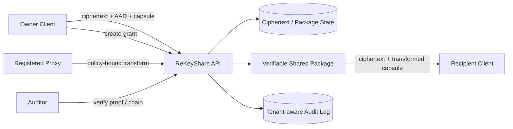

# ReKeyShare

> 面向半可信存储与代理节点的可验证密文共享系统原型。

[](https://adoptium.net/)
[](https://github.com/SuYK-666/ReKeyShare/actions/workflows/backend-ci.yml)
[](docs/ops/ci-quality-gates.md)
[](docs/ops/ci-quality-gates.md)
[](LICENSE)

ReKeyShare 是一个 Java 实现的安全数据共享后端原型，研究在服务端只托管
密文与授权元数据的条件下，如何完成授权代理转换、撤销与轮换、可验证共享包、
多租户对象隔离和可复核安全证据链。

项目将“教学/实验用代理重加密流程”与“可部署的安全工程边界”明确区分：

- `RSA_PRE` 与 `ECC_PRE` 是用于验证工作流和性能对照的 baseline，不是生产级 PRE 承诺。
- `SECURE_ENVELOPE_V1` 是基于 JCA 原语的直接接收方密钥封装路径。
- `HPKE_STYLE_ENVELOPE_V1` 是 KEM/KDF/AEAD 风格的对照封装，不宣称 RFC 9180 互操作，也不是 PRE。
- `POLICY_BOUND_PROOF_V1` 为代理转换结果提供策略、租户、package 和 key-version 绑定证明。

## 核心创新点

ReKeyShare 不只展示“可以分享密文”，而是把分享后的安全语义做成可测试、可恢复、
可审计的工程链路。

| 创新点 | 设计要点 | 已有证据 |
| --- | --- | --- |
| 策略绑定转换证明 | canonical payload 绑定 tenant、data、grant、recipient、package、policy hash、key version、AAD 与 proxy signer epoch | proof tamper/replay 测试 |
| 重启后仍成立的撤销语义 | `SECURE_LOCAL` 使用 JDBC 持久化 live data/grant/package、proof replay、proxy 状态与 audit；revoke/rotation 后旧 package 在重启后仍失效 | `JdbcLiveRepositoryTest` |
| 租户级对象授权闭环 | 正式授权入口统一接收 `SecurityContext`，按 `(tenantId, objectId)` 查询；跨租户探测外部不可区分，内部 audit 记录真实原因 | `TenantAuthorizationTest`、API oracle 测试 |
| 代理机器身份治理 | Proxy 除 bearer subject/角色外，还必须满足 ACTIVE、tenant/scheme allowlist、quota 和注册 credential fingerprint | `ProxyNodeServiceTest` |
| 可验证共享包与审计 | package manifest 绑定密文、AAD、capsule、policy 与 key version；audit hash-chain 与 proof 支持完整性核验 | package/audit 测试 |
| Threshold 治理原型 | signed share + context-bound transcript + durable consumed-session replay 防护，验证 `k-of-n` 参与流程 | threshold context/restart 测试 |
| 攻击证据工程化 | 固定 attack matrix 输出 JSON/CSV/Markdown/raw evidence，CI 保留 SBOM、测试与 checksum artifact | CI 与报告目录 |

## 工作流



1. Owner 在客户端生成内容密钥并加密正文，将密文材料上传到服务端。
2. Owner 创建包含有效期、动作和次数上限的授权。
3. 注册代理节点通过治理校验后转换 capsule，并签发策略绑定证明。
4. Recipient 获取共享包，在客户端侧解封装并解密内容。
5. Owner 撤销授权或轮换内容密钥后，旧 package 被失效。
6. 安全相关行为进入 tenant-aware audit log，可导出验证证据。

## 能力概览

| 类别 | 能力 |
| --- | --- |
| 加密与封装 | AES-GCM、canonical AAD、ciphertext digest、`SECURE_ENVELOPE_V1`、`HPKE_STYLE_ENVELOPE_V1` |
| 授权与撤销 | grant policy、action limits、download/decrypt/transform counters、revoke、owner-side rotation |
| 代理治理 | role、tenant allowlist、scheme allowlist、quota、credential fingerprint binding |
| 证明与审计 | policy-bound proof、durable replay consume、package manifest、hash-chain audit、audit proof |
| 持久化 | H2/JDBC live data/grant/package repositories、replay、idempotency、proxy quota、threshold consumed sessions |
| API 加固 | bearer authentication boundary、稳定错误结构、对象存在性隐藏、请求大小限制、幂等、基础限流 |
| 质量与证据 | JUnit、JaCoCo line/critical branch gates、SpotBugs、Spotless、CycloneDX SBOM、attack matrix artifacts |

## 安全边界

### 已实现

- 正式上传路径 `/api/data/upload-encrypted` 仅接收客户端侧加密材料。
- 服务端业务对象不保存用户明文或用户私钥。
- `ObjectAuthorizationService` 的正式路径以 `SecurityContext` 执行 tenant-aware data/grant/package 授权。
- 不存在对象、他人对象和 wrong-tenant 对象在外部错误响应上使用统一不可访问语义。
- `SECURE_LOCAL` 装配 durable live repositories；grant revoke 与 owner rotation 的安全状态可跨重启恢复。
- `PRODUCTION` 与 `SECURE_LOCAL` 禁止使用 in-memory formal proof replay repository。
- Proxy 使用前验证角色、节点状态、tenant、scheme、quota 与 credential fingerprint。

### 明确不承诺

- Baseline RSA/ECC PRE 不代表经过公开审查的生产密码协议。
- 撤销不能追回接收方已经离线获得的明文。
- 内置 token bootstrap 不是完整企业 IAM；当前仅提供本地 JWKS adapter 验证边界，远端 OIDC/JWKS 接入仍待完成。
- Threshold 路径已经持久防重放，但仍不是独立代理集群或经过审查的 threshold PRE 实现。
- `PRODUCTION` profile 表达正式 API/密码边界，不等价于已经装配外部 KMS、WORM audit anchor 与多实例数据库的生产平台。

详细边界请阅读 [Security Design](docs/SECURITY_DESIGN.md)、
[Threat Model](docs/THREAT_MODEL.md) 和
[Known Limitations](docs/known-limitations.md)。

## 运行模式

| Profile | 用途 | 存储与接口行为 |
| --- | --- | --- |
| `production` | 正式边界验证，默认 profile | 禁用 demo 明文与 baseline transformation 路由；formal proof replay 使用 JDBC 边界；外部 IAM/KMS 仍需部署集成 |
| `secure-local` | 可重启复核的本地安全运行态 | H2/JDBC 持久化 audit、replay、idempotency、proxy、data、grant、package 与 threshold consume；文件对象/本地 key provider |
| `demo` | 教学与端到端流程演示 | 启用 baseline/plaintext fixture 接口；允许进程内适配器 |

### 环境要求

- JDK 17+
- Maven 3.9+
- Node.js 20+，仅在运行 Web console 或前端 SBOM 时需要
- Docker，可选

## 快速开始

### 运行完整验证

```powershell
mvn verify
```

该命令执行单元/集成测试、JaCoCo gates、SpotBugs、Spotless 与 backend SBOM 生成。

### 启动可演示流程

```powershell
mvn -q -DskipTests compile
mvn -q -Drekeyshare.profile=demo exec:java -Dexec.mainClass=com.example.pre.app.ReKeyShareApplication
```

访问：

- 服务状态：`http://localhost:8080/`
- OpenAPI：`http://localhost:8080/openapi.json`
- 审计验证：`http://localhost:8080/api/audit/verify`

### 启动 durable secure-local

```powershell
$env:REKEYSHARE_PROFILE = 'secure-local'
$env:REKEYSHARE_LOCAL_TOKEN_SECRET = 'replace-with-at-least-24-local-chars'
mvn -q -DskipTests compile exec:java -Dexec.mainClass=com.example.pre.app.ReKeyShareApplication
```

默认持久目录：

| 数据 | 路径 |
| --- | --- |
| H2 数据库 | `storage/secure-local/rekeyshare` |
| 密文对象 | `storage/secure-local/objects` |
| 本地 key provider | `storage/secure-local/keys/keys.properties` |

### Docker

```powershell
docker compose up --build
```

### 启动前端控制台

前端位于 `app/`、`components/` 与 `lib/`，提供平台展示首页和 ReKeyShare 控制台。

```powershell
npm install
npm run dev
```

访问：

- 首页：`http://localhost:3000/`
- 控制台：`http://localhost:3000/console`

控制台包含演示驾驶舱、客户端加密上传、对象级授权、代理治理、共享包 Inspector、撤销轮换、策略绑定证明、审计链、攻击验证实验室、性能与算法证据、CI 与交付证据、系统设置等入口。后端不可用时页面会明确标注 `source: mock`，不会把本地演示数据伪装成真实接口成功。

前端提交前运行：

```powershell
npm run lint
npm run build
```

## API 概览

实际可用路由以运行实例的 `/openapi.json` 为准；profile 会控制暴露的功能面。

| API | 说明 | Profile |
| --- | --- | --- |
| `POST /api/data/upload-encrypted` | 上传客户端侧加密后的密文与 capsule | production / secure-local / demo |
| `GET /api/data/{dataId}` | 读取经过对象授权的 metadata | 全部 |
| `GET /api/shared-packages/{packageId}` | 下载经过校验的密文共享包 | 全部 |
| `POST /api/grants/{grantId}/revoke` | 撤销授权并失效相关 package | 全部 |
| `GET /api/audit/verify` | 验证 audit chain | 全部，需审计角色 |
| `POST /api/data/upload` | 明文 fixture 上传 | demo only |
| `POST /api/grants`、`POST /api/proxy/re-encrypt` | baseline 演示授权/转换 | demo only |
| `GET /api/demo/shared-packages/{packageId}/decrypt` | 明文结果核验 | demo only |

Bearer 形式：

```http
Authorization: Bearer <token>
```

正式部署应将该身份边界替换为受信 OIDC/JWKS 或 mTLS integration。

## 可验证性与测试

### 关键验收

| 安全性质 | 验证 |
| --- | --- |
| data/grant/package restart persistence | `JdbcLiveRepositoryTest` |
| revoke + restart 后旧 package 失败 | `JdbcLiveRepositoryTest` |
| rotation + restart 后旧版本失败 | `JdbcLiveRepositoryTest` |
| proof 100 并发消费仅一次成功，重启后重放失败 | `JdbcProofReplayRepositoryTest` |
| tenantA 探测 tenantB 对象被拒绝且可审计 | `TenantAuthorizationTest` |
| missing 与 unauthorized 对象响应结构不可区分 | `ApiIntegrationTest.enumerationOracleResponsesHaveStableStatusCodeMessageAndSchema` |
| proxy wrong fingerprint / inactive / wrong scheme / exhausted quota 拒绝 | `ProxyNodeServiceTest` |
| threshold completed session restart replay 拒绝 | `ThresholdContextBindingTest` |
| JWKS fixture 的 kid/issuer/audience/expiry/tenant/rotation 校验 | `LocalJwksIdentityProviderAdapterTest` |

### 一键证据生成

```powershell
powershell -ExecutionPolicy Bypass -File scripts\verify-all.ps1
```

主要证据目录：

| 路径 | 内容 |
| --- | --- |
| [docs/reports/THIRD_ITERATION_PROGRESS.md](docs/reports/THIRD_ITERATION_PROGRESS.md) | 当前迭代已完成与仍受限项目 |
| [docs/reports/raw](docs/reports/raw) | 实验原始结果 |
| [docs/reports/summary](docs/reports/summary) | 实验摘要 |
| [docs/reports/attack-matrix](docs/reports/attack-matrix) | 攻击矩阵 JSON/CSV/Markdown 与分项 raw evidence |
| [docs/testing/SECOND_ITERATION_TRACEABILITY.md](docs/testing/SECOND_ITERATION_TRACEABILITY.md) | 安全需求到代码、测试、文档的映射 |

CI 会生成并保留测试报告、JaCoCo、SBOM、dependency-check 与 evidence checksum。
启用漏洞扫描时，仓库管理员需配置 GitHub Actions secret `NVD_API_KEY`，CI 会缓存
Dependency-Check 的 NVD 数据以避免每次冷启动下载并降低限流风险。代码质量构建与
网络依赖的漏洞扫描采用独立 jobs；由于 GitHub 不向 fork PR 提供仓库 secrets，
此类 PR 仅运行代码质量门禁，合入 `main` 后再执行漏洞门禁。质量门禁与本地扫描方式见
[CI Quality Gates](docs/ops/ci-quality-gates.md)。

## 项目结构

```text
.
|-- src/main/java/com/example/pre
|   |-- app                 # HTTP application 与验证入口
|   |-- crypto              # AEAD、envelope、proof、threshold、baseline
|   |-- model               # 数据、授权、package、audit 等领域模型
|   |-- security            # identity 与 policy 边界
|   |-- service             # 授权、转换、撤销、审计和生命周期服务
|   `-- storage             # 内存/JDBC/object-store repository adapters
|-- src/main/resources/db  # H2/JDBC schema 与 security-state tables
|-- src/test/java          # 单元、集成、负向与攻击验收测试
|-- docs                   # 架构、安全、报告与追踪文档
|-- scripts                # 验证、实验与质量门禁脚本
|-- app, components        # Next.js Web console
|-- pom.xml
`-- package.json
```

## 文档

| 主题 | 文档 |
| --- | --- |
| 文档导航与事实来源 | [docs/doc-index.md](docs/doc-index.md) |
| 架构与信任边界 | [docs/architecture/PROJECT_POSITIONING.md](docs/architecture/PROJECT_POSITIONING.md)、[docs/SECURITY_DESIGN.md](docs/SECURITY_DESIGN.md) |
| 密码方案定位 | [docs/CRYPTO_SCHEME.md](docs/CRYPTO_SCHEME.md)、[docs/crypto/HPKE_STYLE_ENVELOPE_V1.md](docs/crypto/HPKE_STYLE_ENVELOPE_V1.md) |
| Proof 与 replay | [docs/security/proof-replay.md](docs/security/proof-replay.md) |
| 租户与授权隔离 | [docs/multi-tenant-isolation.md](docs/multi-tenant-isolation.md)、[docs/api/authorization-matrix.md](docs/api/authorization-matrix.md) |
| Proxy 治理 | [docs/security/proxy-governance.md](docs/security/proxy-governance.md) |
| 存储与运行部署 | [docs/storage/repository-design.md](docs/storage/repository-design.md)、[docs/deployment.md](docs/deployment.md) |
| 身份适配边界 | [docs/security/identity-provider.md](docs/security/identity-provider.md) |
| 限制与进展 | [docs/known-limitations.md](docs/known-limitations.md)、[docs/reports/THIRD_ITERATION_PROGRESS.md](docs/reports/THIRD_ITERATION_PROGRESS.md) |

## 路线图

- 将 HTTP dispatcher 重构为声明式 route registry，并由同一声明生成 OpenAPI 与 profile/auth guard。
- 将本地 JWKS fixture adapter 接入远端 OIDC/JWKS refresh 与正式 HTTP identity composition。
- 构建具备独立端口、独立 signing key 与独立失败域的三节点 threshold proxy simulator。
- 将关键安全类 branch coverage floors 提升到目标门槛，并补充 timing oracle 测量证据。
- 在真实部署中对接托管数据库、对象存储、KMS/HSM 与不可变 audit anchor。

## 贡献与安全

- 贡献指南：[CONTRIBUTING.md](CONTRIBUTING.md)
- 安全漏洞报告：[SECURITY.md](SECURITY.md)
- 上游与原创性说明：[docs/UPSTREAM_NOTICE.md](docs/UPSTREAM_NOTICE.md)

## License

ReKeyShare is released under the [MIT License](LICENSE).
